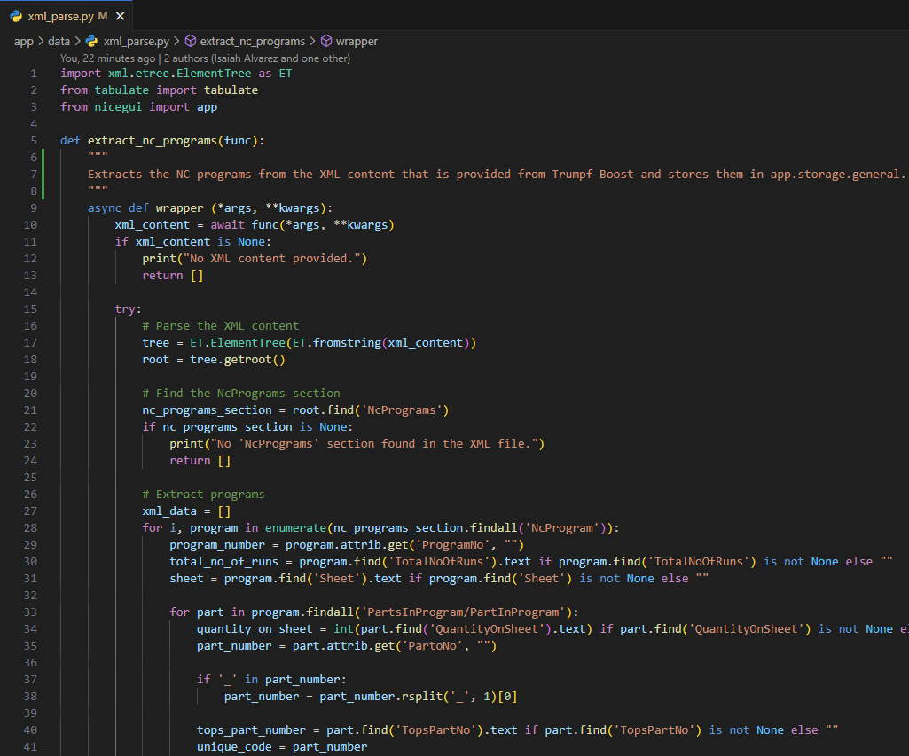
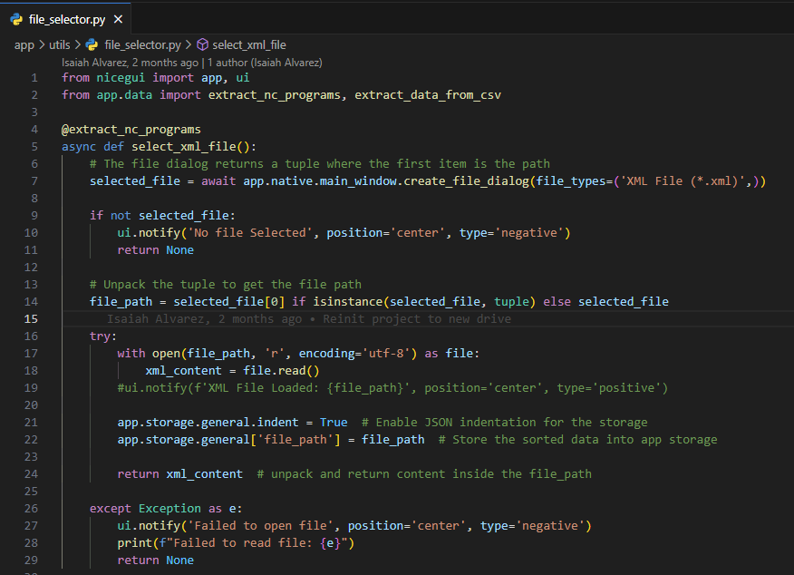

# Label Print

Label Print is a specialized program designed to streamline the process of printing labels from XML and CSV files. This tool is particularly useful in a manufacturing environment where it is essential to identify parts for various projects.

## Table of Contents

- [About the Project](#about-the-project)
  - [Built With](#built-with)
- [Getting Started](#getting-started)
  - [Prerequisites](#prerequisites)
  - [Installation](#installation)
- [Usage](#usage)
- [License](#license)

---

## About The Project

The primary objective of this project is to convert XML data into labels for sheet metal parts, facilitating easy identification in the workshop. The application integrates with Trumpf Boost for nesting DXF files and Solid Edge for additional information retrieval via its API.

This project was initiated to replace an Excel-based solution with VBA macros, which became too customized and limited. By leveraging Python and the NiceGUI framework, this application offers enhanced styling and data binding capabilities, making it a robust and flexible tool.

<video width="640" height="360" controls>
  <source src="./include/Label%20Print%20Demo.mp4" type="video/mp4">
  Your browser does not support the video tag.
</video>

### Built With

- [Python](https://python.org)
- [NiceGUI](https://nicegui.io/)
- [ZPL](https://pypi.org/project/zpl/)

---

## Getting Started

To get a local copy of the project up and running, follow these steps.

### Prerequisites

Ensure you have the following installed:

- Python 3.12+
- pip
- Git

```bash
# Example of installing a prerequisite
pip install -r requirements.txt
```

### Installation

Follow these steps to set up the project locally:

1. Clone the repository:
   ```bash
   git clone https://github.com/your_username/your_project.git
   ```
2. Navigate to the project directory:
   ```bash
   cd your_project
   ```
3. Install the required dependencies:
   ```bash
   pip install -r requirements.txt
   ```
4. Configure additional settings if necessary.

---

## Usage

To run the application, execute the following command:

```bash
python main.py
```

The primary function of this project is to print labels from XML or CSV files. To customize the XML parsing, modify the `xml_parse.py` file located in the `app/data` folder.



After adjusting the XML parsing logic, review the `file_selector` function in the `app/utils` folder. This function uses a decorator to pass the file to the `extract_nc_programs` function, which then saves it to `app.storage.general`. This storage mechanism is part of the NiceGUI framework, enabling data binding.



---

## License

This project is distributed under the MIT License. See the `LICENSE` file for more details.

```markdown
MIT License
```